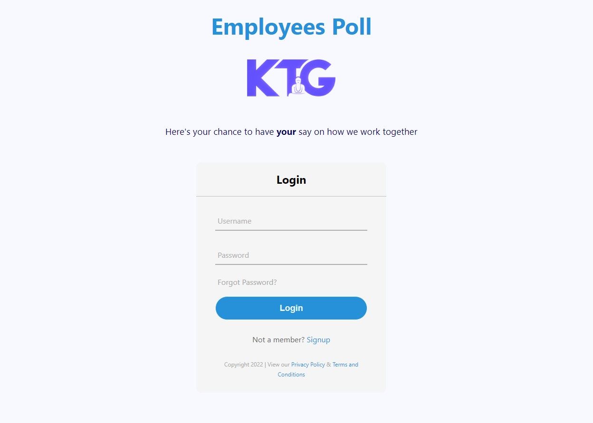
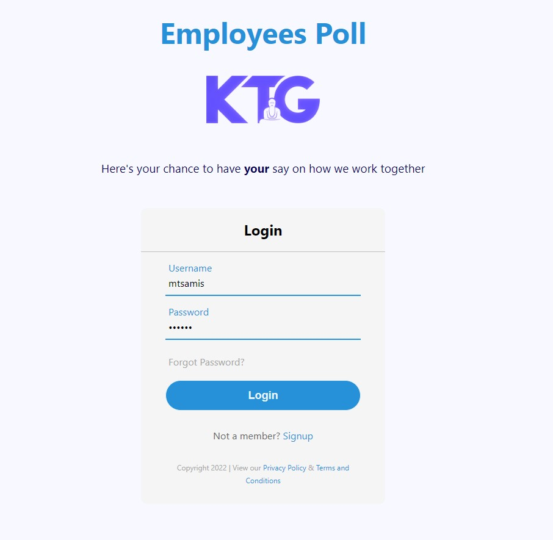
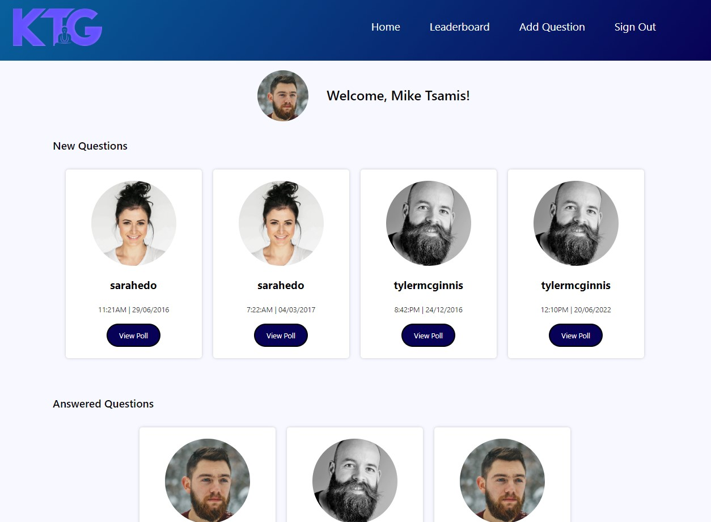
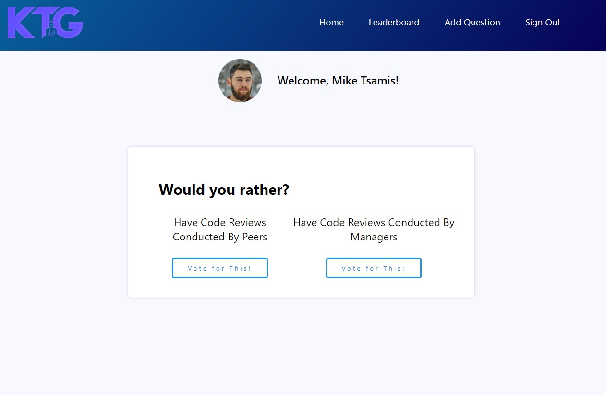
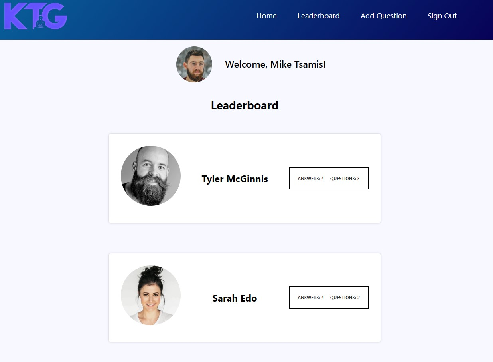
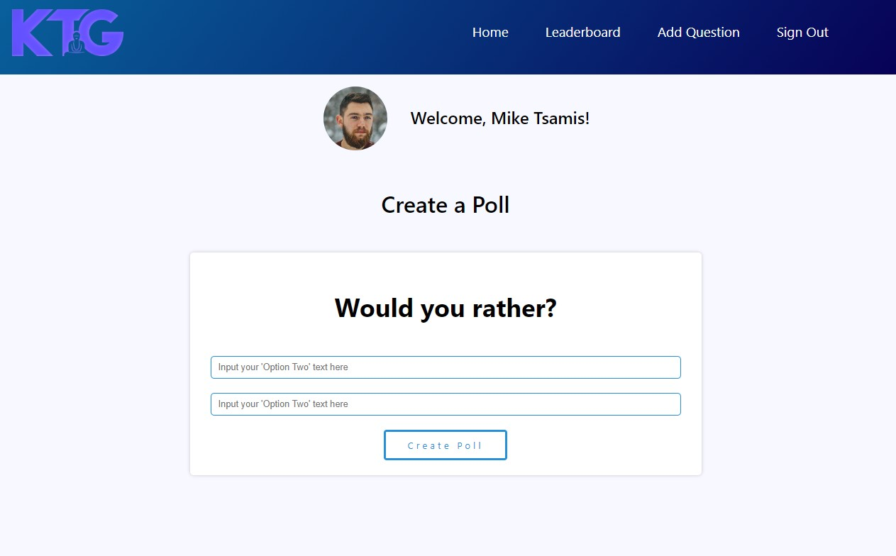

# Employees App using React and Redux-Toolkit

# Table of Contents

- [Employees App using React and Redux-Toolkit](#employees-app-using-react-and-redux-toolkit)
- [Table of Contents](#table-of-contents)
- [Introduction](#introduction)
- [Installation](#installation)
- [Screenshots](#screenshots)
  - [Login Page](#login-page)
  - [Home Page](#home-page)
  - [Poll Page](#poll-page)
  - [Leaderboard Page](#leaderboard-page)
  - [Create a Poll Page](#create-a-poll-page)
- [File Tree](#file-tree)
- [Create React App](#create-react-app)
- [License](#license)

# Introduction

This app allows for an "employee" to answer, view, and create poll questions that are phrased in a "would you rather?" format. The app is built using React and Redux-Toolkit, and the state is made to persist with the aid of Redux-Persist. The app also includes a log in feature, as well as displaying the currents "results" of the polls after the user has answered them.

# Installation

    npm install

    npm start

# Screenshots

## Login Page

The user is first greeted by the login page (\*note: the sign up, privacy policy, and terms & conditions links are not implemented).

Upon selecting the input field, the UI interface changes to allow the user to enter their username and password.

## Home Page

The user, upon logging in, is greeted with the home page. This page acts as a dashboard, and presents the user first with the questions that they have not yet answered, and then with the questions that they have answered.

## Poll Page

When the user clicks on a poll question that they have not yet answered, the user is presented with the options for that poll. After making a selection, the user state is updated so that the question is marked as answered, and the UI also shows the current results of the poll.

## Leaderboard Page

The leaderboard shows the calculation of the combination of the current user's answers given and questions created.

## Create a Poll Page

The user can create a poll question by clicking on the "Create a Poll" button. The user is presented with the input fields to create a question, and the question then immediately becomes available to be answered from the home page (dashboard).

# File Tree

    ├── README.md #This file.
    ├── package.json #npm package manager file.
    ├── public
    └── src
        ├── test
        │ ├── App.test.js
        │ └── setupTests.js
        │
        ├── app
        │ └── store.js
        │
        ├── assets
        │ └── ktg2-final2arctic.png
        │
        ├── components
        │ ├── Add.js
        │ ├── App.js
        │ ├── Card.js
        │ ├── CompletedCard.js
        │ ├── Hero.js
        │ ├── Leaderboard.js
        │ ├── LoginForm.js
        │ ├── Navbar.js
        │ ├── PollQuestion.js
        │ └── Polls.js
        │
        ├── features
        │ ├── authedUser.js
        │ ├── questions.js
        │ └── users.js
        │
        ├── selectors
        │ ├── questions.js
        │ └── users.js
        │
        ├── styles
        │ └── index.css
        │
        ├── utils
        │ ├── DATA.js
        │ ├── api.js
        │ ├── enums.js
        │ ├── helpers.js
        │ └── validators.js
        │
        ├── views
        │ ├── CreatePoll.js
        │ ├── Dashboard.js
        │ ├── Leaderboard.js
        │ ├── LoginPage.js
        │ └── PollPage.js
        │
        └── index.js # Used for DOM rendering only.

# Create React App

This project was bootstrapped with [Create React App](https://github.com/facebook/create-react-app). You can find information about the bootstrapping process [here](https://reactjs.org/docs/create-a-new-react-app.html).

# License

This project is licensed under the MIT license.
