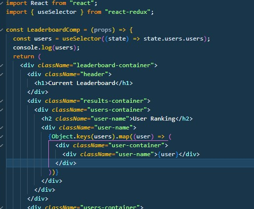
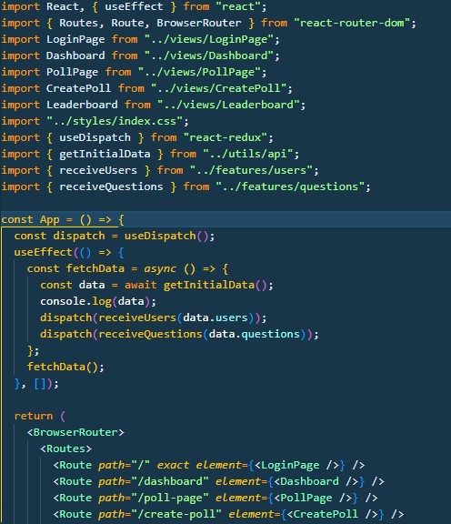
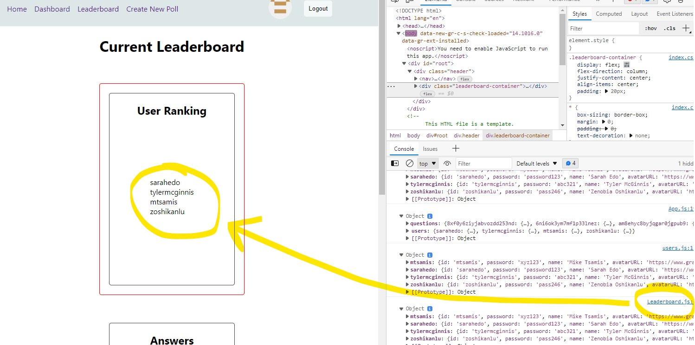
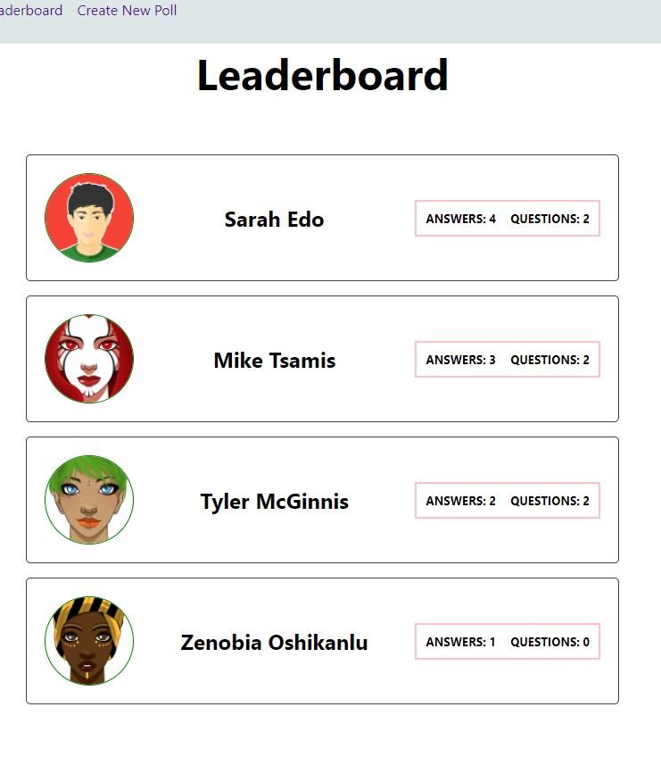
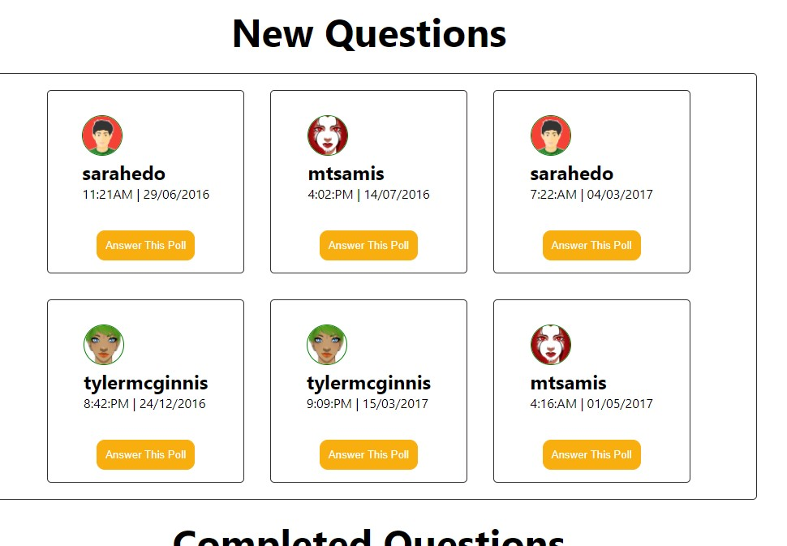

# Planning

1. Identify what each view should look like
2. break each view into a hierarchy of components
3. Determine what events happen in the app
4. Determine what data lives in the store

# Views

1. Home Page / Login
2. Dashboard
3. Poll Page
4. Create Poll Page
5. Leaderboard

# Components

- App
- Login Input Form
- Navbar
- authedUser Info
- Polls Container (complete/incomplete)
- Poll Cards
- Poll
- Create Poll
- Leaderboard

# Actions / Reducers

- Verify Login / handleError (homepage)
- Show Polls Buttons (dashboard on Poll Cards)
- Poll Response (On Poll Questions)
- Create a Poll Input Form

# State

- Everything in the store, except:
  - Input Fields in login component and create poll component

# Next Steps

- HTML/CSS
- Actions / Reducers
- Configure Middleware
- Initialize Data
- Build Dashboard View
- Builld Poll View
- Assess and Plan Next Steps

# HTML/CSS

I like to have at least something to render to get me started.

index.js:

    import React from "react";
    import { createRoot } from "react-dom/client";
    import App from "./components/App";

    const container = document.getElementById("root");
    const root = createRoot(container);
    root.render(<App tab="Home" />);

App.js:

    import React from "react";

    const App = () => {
      return (
        

          <h3>Hello from App.js</h3>
        

      );
    };

    export default App;

# Next Build a Homepage Component

- LoginPage Component
  - Title/Logo/Subtitle Component (perhaps call it 'Hero' component)
  - Login Form Component

We want to align everything centrally for this app:

    //index.css

    .center {
      display: flex;
      flex-direction: column;
      justify-content: center;
      align-items: center;
    }

    .login-form {
      display: flex;
      flex-direction: column;
      justify-content: center;
      align-items: center;
    }

# Create a src/views folder, move the LoginPage view to it, and then create each view one by one

- Dashboard
- Poll Page
- Create Poll Page
- Leaderboard

Quick creation of Dashboard.js view:

    import React from "react";

    const Dashboard = () => {
      return (
        

          <h1>Dashboard</h1>
        

      );
    };

    export default Dashboard;

Now set up **Routes, Route and Router**.

    //index.js

    import { BrowserRouter as Router } from "react-router-dom";

    root.render(
      <Router>
        <App />
      </Router>
    );

And in App.js:

    import { Routes, Route } from "react-router-dom";

    const App = () => {
      return (
        

          <Routes>
            <Route path="/" exact element={<LoginPage />} />
            <Route path="/dashboard" element={<Dashboard />} />
            <Route path="/poll-page" element={<PollPage />} />
            <Route path="/create-poll" element={<CreatePoll />} />
            <Route path="/leaderboard" element={<Leaderboard />} />
          </Routes>
        

      );
    };

Then set up **Link and Link to=""**.

    //LoginForm.js

    import { Link } from "react-router-dom";

    <Link to="/dashboard">
      <button className="btn" type="submit">
          Login
      </button>
    </Link>

And update our App.js:

    const App = () => {
      return (
        

          <Routes>
            <Route path="/" exact element={<LoginPage />} />
            <Route path="/dashboard" element={<Dashboard />} />
          </Routes>
        

      );
    }

# Build out the Pages with very basic html/CSS and Link them all up

**Dashboard:**

**Create Poll Page:**

**Answer Poll Page:**

**Leaderboard:**

# Features (Actions / Reducers)

Required Actions / Reducers:

- Set Authed User
- Poll
  - Create(Add)
  - Toggle(Answer A or B)
  - Receive(Get)
- Users
  - Receive(Get)
- Shared

With Redux Toolkit the combined action/reducer can be placed in a 'features' directory. It becomes its own slice, and "actions" are exported to be used in components. For our users slice, we have this:

    import { createSlice } from "@reduxjs/toolkit";

    export const initialState = {
      users: [],
    };

    const userSlice = createSlice({
      name: "users",
      initialState,
      reducers: {
        receiveUsers: (state, action) => {
          console.log(action.payload);
          state.users = action.payload;
        },
      },
    });

    export const { receiveUsers } = userSlice.actions;

    export default userSlice.reducer;

We can now use **Provider** and connect our App to the store:

    // index.js

    import { store } from "./store";

    root.render(
      <React.StrictMode>
        <Router>
          <Provider store={store}>
            <App />
          </Provider>
        </Router>
      </React.StrictMode>
    );

We can also now create an 'app' directory and build a file called store.js that imports all our features (reducers) and acts as the root reducer:

    import { configureStore } from "@reduxjs/toolkit";
    import userReducer from "../features/users";
    import authedUserReducer from "../features/authedUser";
    import questionReducer from "../features/questions";

    export const store = configureStore({
      reducer: {
        users: userReducer,
        authedUser: authedUserReducer,
        questions: questionReducer,
      },
    });

Finally, we can start to build the data into our components. For example, to simply grab the users and place them into our Leaderboard component:

Our App.js component can dispatch our features as follows:

# Get the Correct Information to Render in the Appropriate Components

Currently, we have just 'hooked up' the data with the features, components, store, and app. Index.js brings it all together. This initial rendering isn't pretty, but it allows us to now move on and build the UI properly:

# Go Through Each View and Perfect the Rendering of the Information

Make a list of the views and go through one-by-one with the idea of making the data render properly depending on what you expect each view to perform. For example, for the Leaderboard component, we don't want to simply list out the users with their answer, but we want to show the ranking order, which will change depending on the calculation of the user's questions and answers combined.

- **Leaderboard** (reflects the ranking, in order, based on total questions created + questions answered)
- **Dashboard** (shows cards that are separated between completed or not completed depending on whether the authedUser has answered them yet)
  - The cards themselves show the user who created the question, their avatar, and a timestamp
  - The card also contains a button to leader the user to answer the question
- **Poll Page**
- **Create Poll**
- **Login Page / Homepage**

## Leaderboard

Ranking functionality should now work, and you should have made a fair idea of how the styling will work (Note in the screenshot below that the combined answers and questions leads to a ranking from highest to lowest).

## Dashboard: Not-Yet-Completed Questions Cards

It is easier to access the questions cards, so we have started with that. Basically we need to pull in both the users data and the questions data so that we can apply the avatar from the users data and render it along with the questions data we are rendering (author and timestamp). We also brought in the timestamp helper function to make the timestamp more readable. Again, just some very basic styling.

## Dashboard: Completed Questions Cards

Now we need to focus on setting up ourselves as an authedUser, so that we can view the experience as though we are logged in and therefore see the states of questions whether they have been completed by the authedUser or not.
