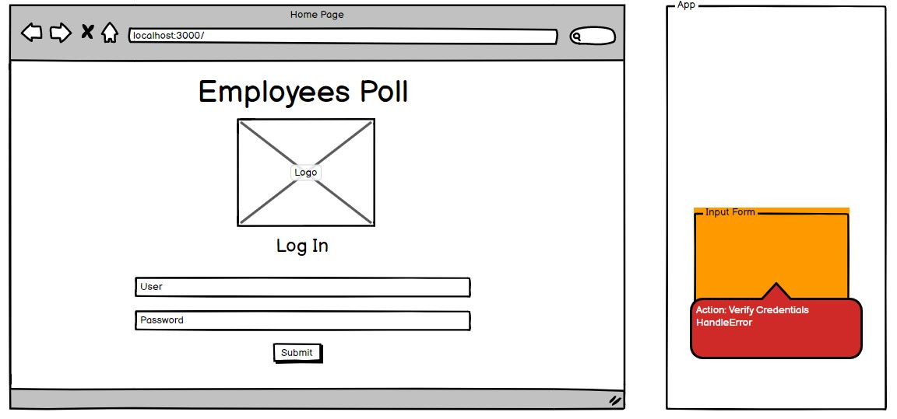
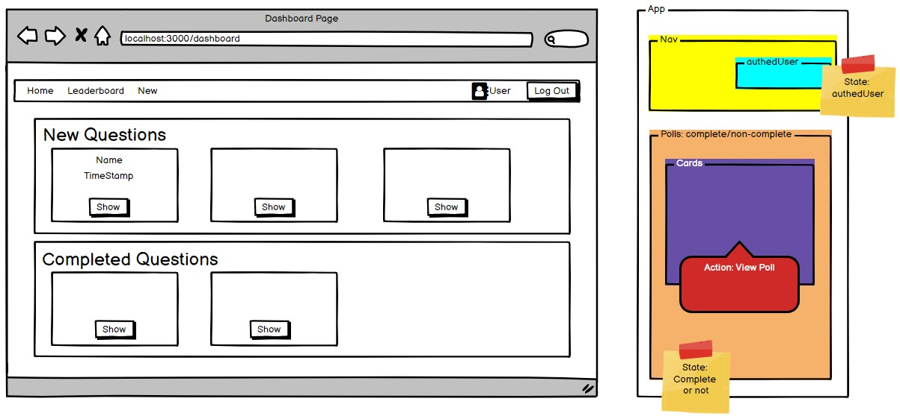
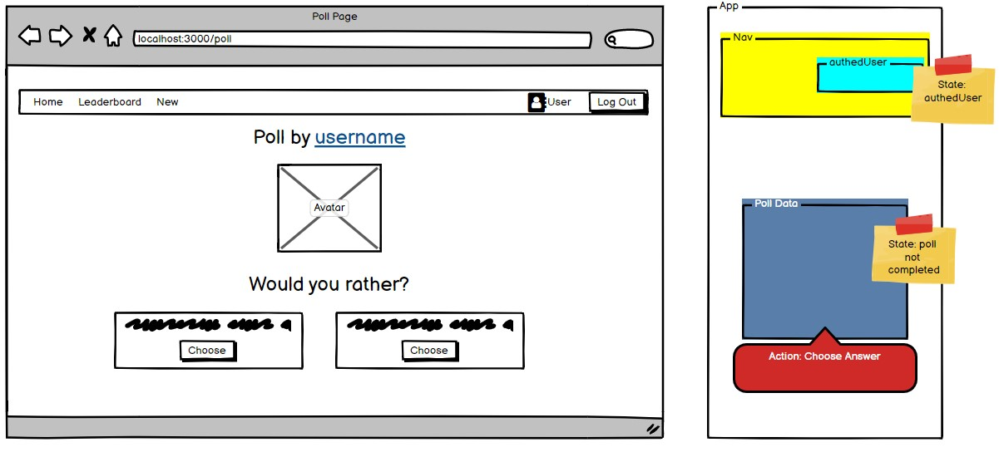
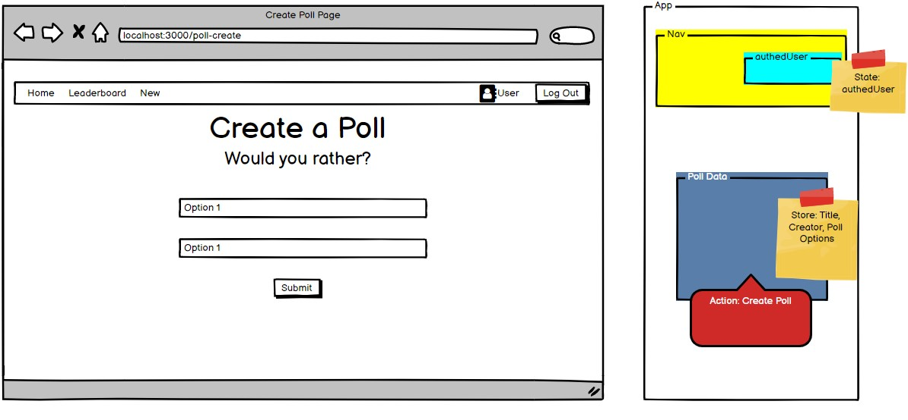
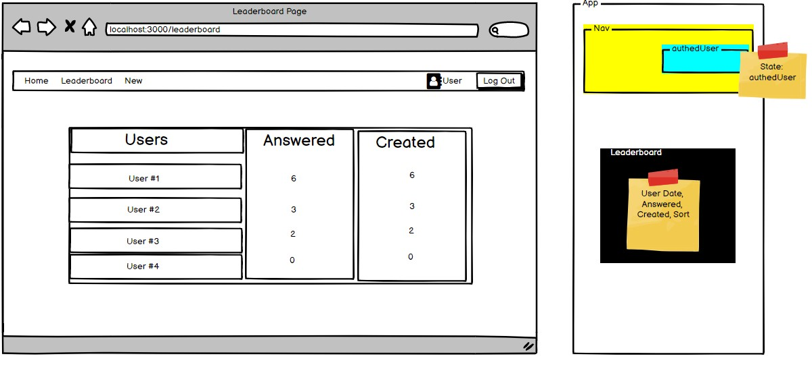
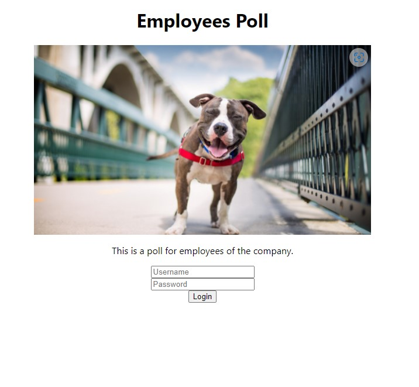
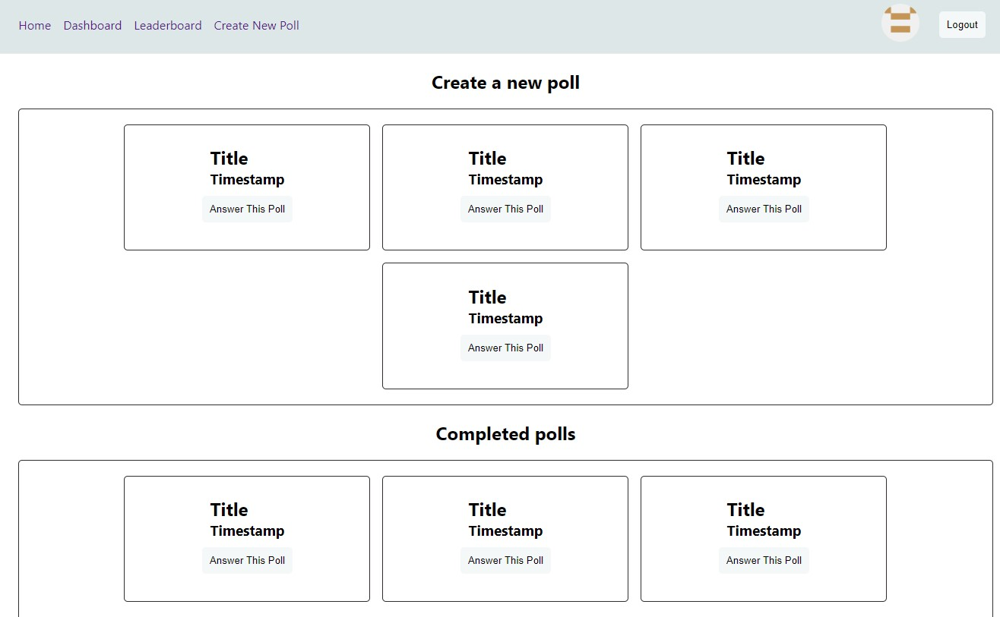
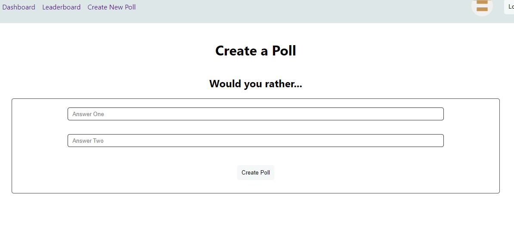
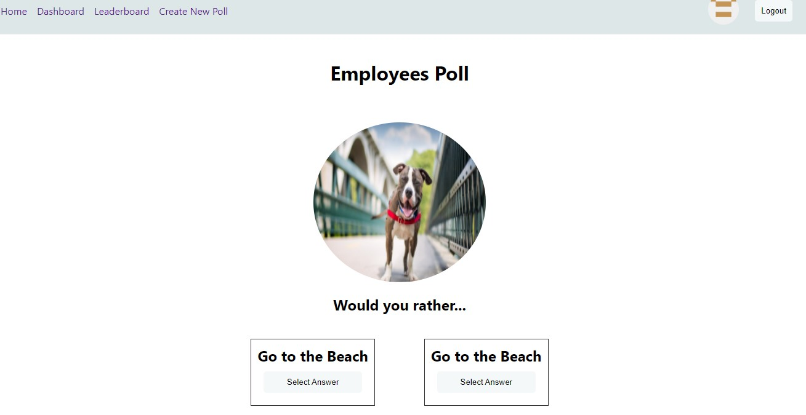
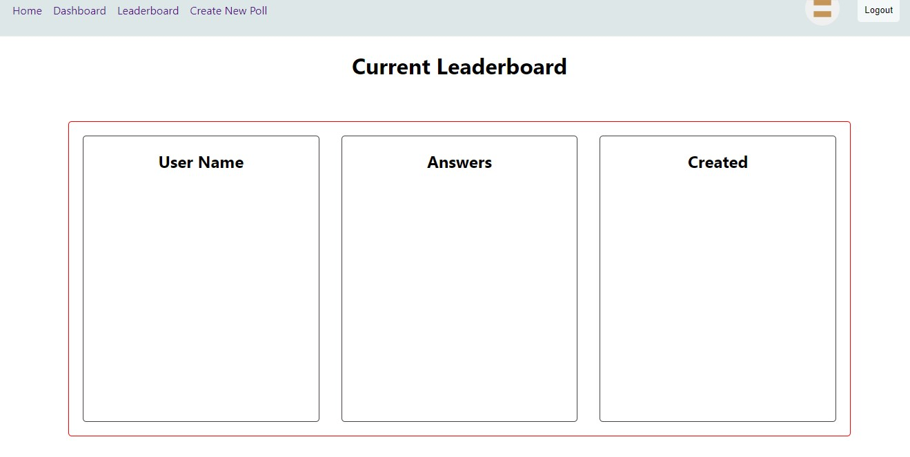

# Planning

1. Identify what each view should look like
2. break each view into a hierarchy of components
3. Determine what events happen in the app
4. Determine what data lives in the store

# Views

1. Home Page / Login
2. Dashboard
3. Poll Page
4. Create Poll Page
5. Leaderboard

# Components

- App
- Login Input Form
- Navbar
- authedUser Info
- Polls Container (complete/incomplete)
- Poll Cards
- Poll
- Create Poll
- Leaderboard

# Actions / Reducers

- Verify Login / handleError (homepage)
- Show Polls Buttons (dashboard on Poll Cards)
- Poll Response (On Poll Questions)
- Create a Poll Input Form

# State

- Everything in the store, except:
  - Input Fields in login component and create poll component

# Next Steps

- HTML/CSS
- Actions / Reducers
- Configure Middleware
- Initialize Data
- Build Dashboard View
- Builld Poll View
- Assess and Plan Next Steps

# HTML/CSS

I like to have at least something to render to get me started.

index.js:

    import React from "react";
    import { createRoot } from "react-dom/client";
    import App from "./components/App";

    const container = document.getElementById("root");
    const root = createRoot(container);
    root.render(<App tab="Home" />);

App.js:

    import React from "react";

    const App = () => {
      return (
        

          <h3>Hello from App.js</h3>
        

      );
    };

    export default App;

# Next Build a Homepage Component

- LoginPage Component
  - Title/Logo/Subtitle Component (perhaps call it 'Hero' component)
  - Login Form Component

We want to align everything centrally for this app:

    //index.css

    .center {
      display: flex;
      flex-direction: column;
      justify-content: center;
      align-items: center;
    }

    .login-form {
      display: flex;
      flex-direction: column;
      justify-content: center;
      align-items: center;
    }

# Create a src/views folder, move the LoginPage view to it, and then create each view one by one

- Dashboard
- Poll Page
- Create Poll Page
- Leaderboard

Quick creation of Dashboard.js view:

    import React from "react";

    const Dashboard = () => {
      return (
        

          <h1>Dashboard</h1>
        

      );
    };

    export default Dashboard;

Now set up **Routes, Route and Router**.

    //index.js

    import { BrowserRouter as Router } from "react-router-dom";

    root.render(
      <Router>
        <App />
      </Router>
    );

And in App.js:

    import { Routes, Route } from "react-router-dom";

    const App = () => {
      return (
        

          <Routes>
            <Route path="/" exact element={<LoginPage />} />
            <Route path="/dashboard" element={<Dashboard />} />
            <Route path="/poll-page" element={<PollPage />} />
            <Route path="/create-poll" element={<CreatePoll />} />
            <Route path="/leaderboard" element={<Leaderboard />} />
          </Routes>
        

      );
    };

Then set up **Link and Link to=""**.

    //LoginForm.js

    import { Link } from "react-router-dom";

    <Link to="/dashboard">
      <button className="btn" type="submit">
          Login
      </button>
    </Link>

And update our App.js:

    const App = () => {
      return (
        

          <Routes>
            <Route path="/" exact element={<LoginPage />} />
            <Route path="/dashboard" element={<Dashboard />} />
          </Routes>
        

      );
    }

# Build out the Pages with very basic html/CSS and Link them all up

**Dashboard:**

**Create Poll Page:**

**Answer Poll Page:**

**Leaderboard:**

# Actions / Reducers

Required Actions / Reducers:

- Set Authed User
- Poll
  - Create(Add)
  - Toggle(Answer A or B)
  - Receive(Get)
- Users
  - Receive(Get)
- Shared

With Redux Toolkit the combined action/reducer looks like this:

    import { createSlice } from "@reduxjs/toolkit";

    export const counterSlice = createSlice({
      name: "counter",
      initialState: {
        count: 0,
      },
      reducers: {
        increment: (state) => {
          state.count += 1;
        },
        decrease: (state) => {
          state.count -= 1;
        },
      },
    });

    // each case under reducers becomes an action creator
    export const { increment, decrease } = counterSlice.actions;

    export default counterSlice.reducer;

But before this, we can now use **Provider** and connect our App to the store:

    // index.js

    import { store } from "./store";

    root.render(
      <React.StrictMode>
        <Router>
          <Provider store={store}>
            <App />
          </Provider>
        </Router>
      </React.StrictMode>
    );

And you store.js file should read:

    import { configureStore } from "@reduxjs/toolkit";
    import myReducer from "./reducers/mySlice";

    export const store = configureStore({
      reducer: {
        myCounter: myReducer,
      },
    });
